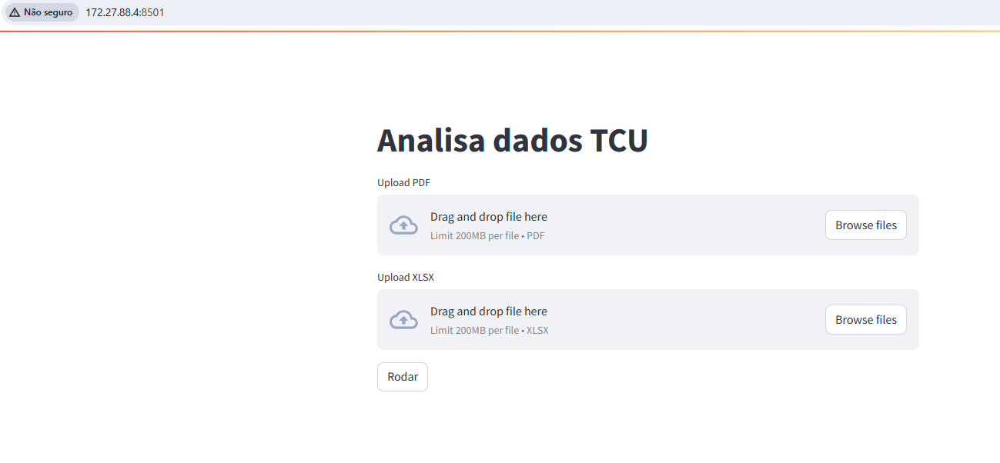

# Analisa Dados TCU

Este aplicativo foi criado para demonstrar como realizar a análise e junção de um arquivo PDF e um arquivo XLSX utilizando o Streamlit. O aplicativo permite que o usuário carregue um arquivo PDF e um arquivo XLSX, e então realiza a junção das bases de dados, gerando um arquivo XLSX com o resultado.

## Como o aplicativo foi construído

1. **Configuração do ambiente**:
   - Instale as bibliotecas necessárias: Streamlit, Pandas, PyPDF2, openpyxl e XlsxWriter.
     ```bash
     pip install streamlit pandas PyPDF2 openpyxl xlsxwriter
     ```

2. **Estrutura do aplicativo**:
   - O aplicativo utiliza o Streamlit para criar a interface de usuário.
   - O arquivo PDF é lido usando a biblioteca PyPDF2 e seu conteúdo é convertido em um DataFrame do Pandas.
   - O arquivo XLSX é lido diretamente em um DataFrame do Pandas.
   - A junção das bases é realizada pela coluna "nome".
   - O resultado é salvo em um novo arquivo XLSX que pode ser baixado pelo usuário.

3. **Código principal do aplicativo**:
   - O aplicativo foi implementado em um arquivo Python (`app.py`). A parte que vocês devem modificar é a função `analisa_dados`, que lê os arquivos PDF e XLSX e faz a junção das bases:


```python

def analisa_dados (pdf_file, xlsx_file):
    ## passo 1: lê o arquivo pdf

    # por exemplo:
    # pdf_reader = PyPDF2.PdfReader(pdf_file)
    # text = []
    # for page in pdf_reader.pages:
    #     text.append(page.extract_text())
    # text = "\n".join(text)
    # lines = text.split("\n")
    # df = pd.DataFrame(lines, columns=["content"])
    # return df

    ## passo 2: lê o arquivo xlsx (talvez precise fazer algum ajuste)
    xlsx_df = pd.read_excel(xlsx_file)

    ## passo 3: faz o merge dos dois arquivos
    # por exemplo:
    # joined_df = pd.merge(pdf_df, xlsx_df, on="nome", how="left")

    # o código abaixo é temporário. Substituir
    # pelo resultado do merge
    joined_df = xlsx_df

    return joined_df

```

## Como executar o aplicativo

1. Certifique-se de ter todas as dependências instaladas:

```bash
pip install streamlit pandas PyPDF2 openpyxl xlsxwriter
```

2. Na linha de comando, execute o aplicativo com o Streamlit:

```bash
streamlit run app.py
```

(não se esqueça de estar no diretório onde o arquivo `app.py` está localizado)

O resultado será uma página assim:



## Lista de Tarefas

1. **Passo 1: Ler o arquivo PDF**:
   - Implementar a leitura do arquivo PDF e a conversão do conteúdo em um DataFrame do Pandas, como vocês já fizeram antes.

2. **Passo 2: Ler o arquivo XLSX**:
   - Implementar a leitura do arquivo XLSX em um DataFrame do Pandas.

3. **Passo 3: Fazer a junção das bases**:
    - Implementar a junção das bases de dados utilizando a coluna que contém os nomes como chave.

4. **Extra: Documentação**:
   - Melhorar a documentação do código, adicionando comentários detalhados e explicações sobre cada parte do processo.

